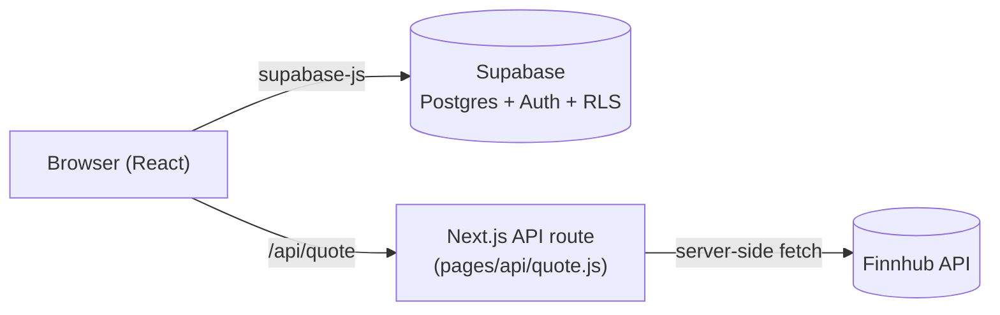
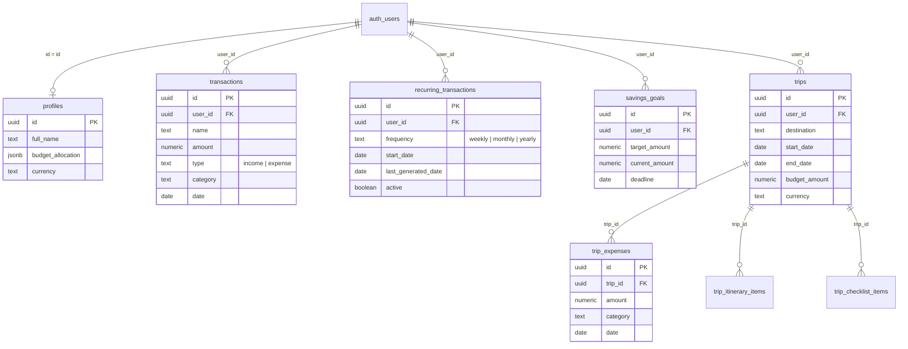

# Architecture

This document explains how Nova Finance is put together: the runtime
architecture, the data model, the provider hierarchy, and the handful of
non-obvious mechanisms (the recurring-transaction engine, the stock proxy,
multi-currency formatting) that are easy to misunderstand from the code alone.

## 1. High-level shape



There is no custom backend. Every read/write to app data (transactions,
budgets, trips, goals, …) goes straight from the browser to Supabase via
`@supabase/supabase-js`, authorized by the user's JWT and enforced by Postgres
Row Level Security — the client can only ever see or mutate rows where
`user_id = auth.uid()`. The **one** exception is stock quotes: those go
through `pages/api/quote.js`, a thin Next.js API route, so the Finnhub API key
stays server-side (see [§5](#5-the-stocks-proxy)).

## 2. Provider hierarchy

`pages/_app.js` nests four context providers, innermost depends on outermost:

```
ThemeProvider          — reads/writes localStorage + toggles the `dark` class on <html>
  LanguageProvider      — reads/writes localStorage, exposes t()
    AuthProvider         — wraps supabase.auth, exposes { user, session, signIn, signUp, signOut }
      ProfileProvider     — fetches the `profiles` row for the current user
        <Component />
```

`ProfileProvider` depends on `AuthProvider` (it needs `user.id` to fetch), which
is why it's nested inside it. `Layout.js` (used by every authenticated page)
reads `AuthContext` to redirect to `/login` when there's no session, and reads
`ThemeContext`/`LanguageContext` to render the toggles in the sidebar.

Every other piece of app data (transactions, trips, goals, budgets' category
allocation, recurring templates) is **not** in a global context — it's fetched
per-page through a dedicated hook in `lib/` (`useTransactions`, `useTrips`,
`useSavingsGoals`, `useRecurringTransactions`, `useTripDetail`). This keeps
pages that don't need, say, the trip list from ever fetching it. Budgets are
the one exception: `budget_allocation` lives on the `profiles` row and is
therefore read through `ProfileContext`, not its own hook.

## 3. Data model

All tables are in the `public` schema, one row per user per resource, RLS'd
identically: `select`/`insert` check `auth.uid() = user_id` (or `= id` for
`profiles`), `update`/`delete` the same. See `supabase/schema.sql` for the
literal DDL — this is the conceptual shape:



`profiles.budget_allocation` is a `jsonb` map of category name → percentage
(e.g. `{"Housing": 25, "Food": 15}`), not a separate table — it's small,
always read/written as a whole, and never queried by key, so a join table
would add cost without adding capability.

## 4. Recurring transactions engine

There is no server-side cron (no Supabase Edge Function, no `pg_cron`). Instead,
`lib/recurringEngine.js` runs **lazily**: every time `useTransactions` fetches
the transaction list, it first calls `generateDueTransactions(supabase, userId)`,
which:

1. Loads the user's active `recurring_transactions` templates.
2. For each template, walks forward from `last_generated_date` (or `start_date`
   if it's never run) one `frequency` step at a time, collecting every
   occurrence date that has passed, capped at 60 per call so a template that's
   been inactive for years can't generate an unbounded backlog in one request.
3. Bulk-inserts the resulting rows into `transactions`.
4. Updates each template's `last_generated_date` to the last occurrence it
   just generated.

This means a recurring bill only "catches up" when the user actually opens the
app — there's no guarantee a transaction appears exactly on its due date if
the app goes unopened, only that it will have appeared (backdated correctly)
by the next visit. Monthly frequency clamps to the target month's last day
(so a start date of Jan 31 lands on Feb 28/29, not into March) — see
`addInterval()` in the same file.

If this needs to become "exactly on the day, even if the user is offline," the
natural upgrade is a Supabase Edge Function on a `pg_cron` schedule calling the
same due-date logic server-side — the algorithm doesn't change, only who calls
it and when.

## 5. The stocks proxy

`pages/api/quote.js` is the only server-side code in the app. It exists
because Finnhub's API key must not reach the browser bundle. The route:

- Reads `symbol` from the query string.
- Calls Finnhub with `FINNHUB_API_KEY` (server-side env var, no `NEXT_PUBLIC_`
  prefix).
- Normalizes Finnhub's response shape and returns 404 for an unknown symbol
  (Finnhub itself returns all-zero fields instead of an HTTP error, which the
  route detects and translates).
- Returns 501 if the key isn't configured, which `pages/stocks.js` renders as
  an inline "not configured yet" notice rather than a crash.

The client-side watchlist (which tickers to show) is stored in
`localStorage`, not Supabase — it's a display preference, not financial data,
so it doesn't need RLS or cross-device sync to justify a table.

## 6. Multi-currency

Every user picks a currency on their profile (`profiles.currency`, ISO 4217,
default `USD`). `lib/currency.js` exports one function, `formatCurrency(amount,
currencyCode)`, backed by a small `Intl.NumberFormat` instance cache keyed by
currency code. **No component should construct its own `Intl.NumberFormat`
with a hardcoded currency** — the one deliberate exception is the Stocks page,
where quotes are always in USD because that's the currency the market data
provider returns, regardless of the user's own currency preference.

Trips carry their **own** currency (a trip to Japan might be budgeted in JPY
even if the user's profile default is EUR) — `trips.currency`, set at trip
creation, independent of `profiles.currency`.

## 7. i18n

`lib/translations.js` is a flat dictionary keyed by locale (`en`/`fr`), each a
nested object by page/feature namespace (`dashboard.*`, `trips.*`,
`categories.*`, …). `LanguageContext` exposes `t(key)` (dot-path lookup, falls
back to the key itself if missing) and persists the chosen locale to
`localStorage`. There's no ICU pluralization or interpolation library —
strings are short enough that template literals around `t()` calls are
sufficient. Any new user-facing string must be added to **both** locales in
the same PR; a missing key silently renders as the raw dot-path, which is an
easy visual tell during review.

## 8. Design system notes

- **Palette**: category colors (both the main expense categories and the
  separate trip-expense tag colors) come from a validated categorical palette
  chosen for colorblind-safety — see the hex values and their dark-mode steps
  in `lib/categories.js` and `lib/tripCategories.js`. The order is fixed and
  should not be reshuffled or reused for unrelated series.
- **Dark mode**: class-based (`darkMode: "class"` in `tailwind.config.js`).
  `ThemeContext` toggles a `dark` class on `<html>`; components pair every
  light utility with an explicit `dark:` one using the same literal hex steps
  as the palette (e.g. `dark:bg-[#1a1a19]`) rather than Tailwind's generic
  `gray-800`/`gray-900`, so surfaces and chart colors stay visually consistent
  with each other in both modes.
- **Charts** (Recharts): the dashboard trend chart and category donut both
  ship a legend, a tooltip, and use semantic (not arbitrary) color — green/red
  for income/expense, the fixed categorical order for categories.

## 9. Notifications

There's no push/email infrastructure — notifications are computed **client-side,
on every page load**, by `lib/useNotifications.js`, which `Layout.js` mounts
once (via `NotificationBell`) so it runs no matter which page the user is on.
It queries transactions, `savings_goals`, `recurring_transactions`, and `trips`
directly (not through each resource's own page-level hook, to avoid Layout
depending on whichever page happens to be rendered) and derives four kinds of
alert, purely from data already in the database — no new table:

| Type | Condition | Severity |
|---|---|---|
| `budget` | this month's spend in a category exceeds its `budget_allocation` share of this month's income | warning |
| `goalOverdue` / `goalDeadline` | a savings goal's `deadline` has passed / falls within 7 days, and it isn't yet funded | warning / info |
| `recurringDue` | a recurring template's next occurrence (`last_generated_date` + one `frequency` step, via the same `addInterval()` used by the recurring engine, §4) falls within 3 days | info |
| `tripUpcoming` | a trip's `start_date` falls within 7 days | info |

Each notification carries an `href` so clicking it in the bell's dropdown
navigates straight to the relevant page (`/budgets`, `/goals`, `/recurring`,
a specific `/trips/[id]`). Messages are built from translation strings with
literal `{placeholder}` tokens and `.replace()` — the same lightweight
approach as the rest of i18n (§7), not a new templating mechanism.

This means notifications are **pull, not push**: they only reflect reality
at the moment the user has the app open, and they reset on every page
navigation rather than being dismissed/persisted. There is intentionally no
"mark as read" state — the alert simply stops appearing once its underlying
condition (over budget, deadline passed, bill due) is no longer true.

## 10. Known limitations / natural next steps

- Recurring transactions and the trip/goal/budget data are all
  single-user — there's no shared household or multi-user trip collaboration.
  Adding it would mean introducing a `household_id` or a join table and
  rethinking the RLS policies (`auth.uid() = user_id` would become a
  membership check).
- No automated tests yet. The hooks in `lib/` are the natural seam for unit
  tests (each is a pure-ish function of Supabase responses); the recurring
  engine's date math (`lib/recurringEngine.js`) is the highest-value place to
  start given how easy off-by-one month/leap-year bugs are to introduce there.
- The recurring engine's catch-up is lazy (see §4) — fine for a personal app,
  not fine if the product ever needs guaranteed same-day generation.
- Notifications (§9) are in-app only. If the product ever needs to reach a
  user who isn't looking at the app (an email when a bill is due, a push
  alert when over budget), that's a genuinely new piece of infra — a
  Supabase Edge Function on a schedule plus an email provider (e.g. Resend)
  — not an extension of the current hook.
